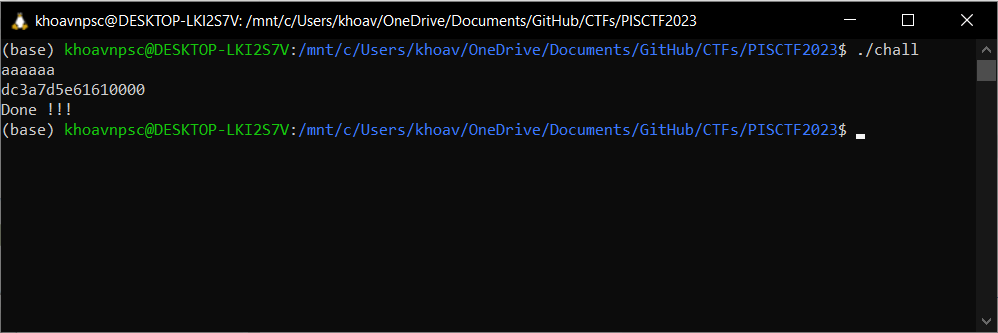

# PISCTF 2023

# Easy eBPF

Cơ bản về eBPF: https://ebpf.io/what-is-ebpf/

Đề cho ta 2 file, `chall` và `stdout`, `chall` là ELF executable còn `stdout` có thể được xem như 1 file text.

Nội dung file `stdout`:

```
b773725a002e9f8bf7eb2f0313cd53014ae47f5902468bb2ebd56c32cfa76420149334557967007d
Done !!!
```

## Description

> output: ./chall > stdout
input: ???
> 

Thử chạy chương trình với input là `aaaaaa`:



Từ output và description có thể suy ra được rằng file `stdout` kia là output khi chạy chương trình `chall` với input là flag.

Vì là ELF nên thử đưa vào IDA, việc đầu tiên mình để ý là rất nhiều syscalll được gọi


Syscall với tham số đầu là `321`, tra ở [đây](https://blog.rchapman.org/posts/Linux_System_Call_Table_for_x86_64/) thì nó gọi đến `sys_bpf`

## Phân tích chương trình

Vì là BPF nên mình nghĩ đến [seccomp-tools](https://github.com/david942j/seccomp-tools) đầu tiên:


Không dump ra được gì, có vẻ như seccomp-tools không dùng để dump eBPF được.

Dùng strace `strace -e bpf` để dump ra những lần `sys_bpf` được gọi, thử nó lên binary:


Đối chiếu với function signature của `bpf()`, tham khảo tại [bpf(2)](https://man7.org/linux/man-pages/man2/bpf.2.html):

```c
int bpf(int cmd, union bpf_attr *attr, unsigned int size);
```

Những cmd đã được gọi:

- `BPF_MAP_CREATE`
- `BPF_PROG_LOAD`
- `BPF_MAP_UPDATE_ELEM`
- `BPF_MAP_UPDATE_ELEM`

`bpf()` đầu tiên được gọi với `cmd = BPF_MAP_CREATE` để tạo map, map này sẽ được dùng chung bởi chương trình chính và chương trình eBPF. 

`BPF_PROG_LOAD` Verify và load chương trình eBPF, chương trình được load lên sẽ không được chạy ngay mà sẽ nằm trong kernel.

Đến đây thì ta có thể tiến hành dump chương trình eBPF để phân tích tĩnh.

## Dump chương trình eBPF bằng debugger

Chương trình eBPF được load lên bằng `BPF_PROG_LOAD` sẽ nằm tại `insns` của **`union bpf_attr ****attr*`. Đặt breakpoint ngay tại lúc `syscall` được gọi.


Mình sẽ debug bằng IDA luôn

Nhìn vào preview thì thấy có `prog_type` và `insn_cnt`, sure kèo là **`union bpf_attr ****attr`* rồi nên là nhảy vào địa chỉ.


Đối chiếu với doc, sẽ phân loại được các field mình cần


Nhảy vào `insns` và dump ra bằng Hex View, số lượng byte cần dump là 552 bytes (552 = 69 x 8: `insn_cnt` nhân với size của struct `bpf_insn`)


## Encryption algorithm

Nói nhanh qua thì sẽ có 2 program, program no.1 là ELF binary của challenge và program no.2 là program eBPF đã được load, 2 program này dùng chung một map được tạo `BPF_MAP_CREATE` đã được đề cập đến ở trên.

Thuật toán ở program chính cũng khá đơn giản


`bpf_map_update_elem(map_fd, key, value, flags)`: gọi đến `bpf(BPF_MAP_UPDATE_ELEM, {map_fd, key, value, flags}, 120)`. Lưu một cặp key value mới lên map.

`bpf_map_lookup_elem(map_fd, key, value, flags)`: gọi đến `bpf(BPF_MAP_LOOKUP_ELEM, {map_fd, key, value, flags}, 120)`. Dùng key để tìm giá trị trên map, kết quả sẽ được lưu vào `value`.

Toàn bộ quá trình encryption sẽ diễn ra trong vòng lặp while, trước khi vào vòng lặp thì array `input` được khai báo với kiểu dữ liệu int, mỗi index của `input` sẽ lưu 4 char người dùng nhập từ `stdin`. Biến `i` có giá trị ban đầu là 0 còn biến `i_reversed` có giá trị ban đầu là độ dài của array `input`.

Ở mỗi vòng lặp while, program chính thêm vào map địa chỉ của biến `i_reversed` với key là 0, địa chỉ của `input` tại index `i` với key là 1, địa chỉ của `input` tại index `i + 1` với key là 2. sau đó chương trình chính sẽ chạy chương trình eBPF đã được load sẵn trên kernel bằng cách gọi hàm `run_ebpf()` để encrypt những giá trị đã lưu trên map, và gọi `bpf_map_lookup_elem` để update lại `input` với giá trị đã được encrypt.

Cách chương trình chính chạy chương trình eBPF sử dụng socket đã được đề cập ở [đây](https://lwn.net/Articles/625224/).

> Once the program is loaded, it will be run on every packet that shows up on the given socket.
> 


Hàm `run_ebpf()` làm một công việc duy nhất, đó là gọi `write()` để truyền packet vào socket. Với điều kiện là socket đó được attach vào chương trình eBPF bằng `setsocketotp()`. Sau khi hàm `write()` được gọi cũng là lúc chương trình eBPF trên kernel được chạy.

Việc cần làm là reverse code eBPF và viết script giải.

## Viết **disassembler**

Thật ra cũng có thể tìm được disassembler trên mạng, nhưng những disassembler mình tìm được thì hoặc là thiếu instruction mình cần, hoặc là cho ra assembly không đúng ý mình. Mục tiêu là viết đủ opcode xuất hiện trong bài này nên nó cũng sẽ không dài lắm.

Tìm xem trong binary dùng những opcode nào.

```python
binary = open("dump", "rb").read()
used_opcode = set([binary[i] for i in range(0, len(binary), 8)])
print([hex(x) for x in used_opcode])
```

Sau đó viết dictionary để convert từ opcode sang instruction, tham khảo instruction list tại [đây](https://github.com/iovisor/bpf-docs/blob/master/eBPF.md).

eBPF instruction có 2 trường hợp:

- Những instruction chỉ dùng 1 struct `bpf_insn`, mình sẽ define trong `ins` dict.
- Những instruction dùng 2 struct `bpf_insn`, mình sẽ define trong `ins_2` dictá. Thông tin về 64-bit immediate instruction tham khảo tại **[64-bit immediate instructions](https://docs.kernel.org/bpf/instruction-set.html#id12)[¶](https://docs.kernel.org/bpf/instruction-set.html#bit-immediate-instructions),** và phần định nghĩa tại [bpf/bpf_insn.h](https://github.com/torvalds/linux/blob/master/samples/bpf/bpf_insn.h) (`#define BPF_LD_IMM64_RAW(DST, SRC, IMM)`)

```python
binary = open("dump", "rb").read()
ins = {
    0x62: f"{'stw':<10} [dst+off], imm",
    0x63: f"{'stxw':<10} [dst+off], src",
    0x85: f"{'call':<10} imm",
    0x7: f"{'add':<10} dst, imm",
    0x27: f"{'mul':<10} dst, imm",
    0x67: f"{'lsh':<10} dst, imm",
    0xc: f"{'add32':<10} dst, src",
    0xaf: f"{'xor':<10} dst, src",
    0x94: f"{'mod32':<10} dst, imm",
    0x55: f"{'jne':<10} dst, imm, +off",
    0x95: f"exit",
    0xb7: f"{'mov':<10} dst, imm",
    0x79: f"{'ldxdw':<10} dst, [src+off]",
    0x57: f"{'and':<10} dst, imm",
    0x77: f"{'rsh':<10} dst, imm",
    0xbf: f"{'mov':<10} dst, src"
}

ins_2 = { # For 64-bit instructions
    0x18: f"{'lddw':<10} dst, imm",
}
```

Bước cuối sẽ là parse instruction từ raw, format rồi in nó ra.

```python
for i in range(0, len(binary), 8):
    # begin parsing
    opc, dst, off, imm = unpack("<BBhi", binary[i : i + 8])
    src = dst >> 4
    dst &= 0xf
    # end parsing, begin printing
    if(opc in ins):
        print(ins[binary[i]].replace("dst", f"r{dst}").replace("src", f"r{src}").replace("+off", f"+{off}" if(off > 0) else f"{off}" if(off < 0) else "").replace("imm", str(imm) if(imm<10 and imm>-10) else hex(imm)))
    elif(opc in ins_2):
        imm2 = unpack("<i", binary[i + 12 : i + 16])[0]
        imm = imm2 << 32
        print(ins_2[binary[i]].replace("dst", f"r{dst}").replace("src", f"r{src}").replace("+off", f"+{off}" if(off > 0) else f"{off}" if(off < 0) else "").replace("imm", str(imm) if(imm<10 and imm>-10) else hex(imm)))
    # end printing
```

Và đây là output, toàn bộ chương trình eBPF:

```nasm
lddw       r9, 0
mov        r1, r9
mov        r2, r10
add        r2, -4
stw        [r10-4], 0
call       1
jne        r0, 0, +1
exit
ldxdw      r6, [r0]
mov        r0, 0
lddw       r9, 0
mov        r1, r9
mov        r2, r10
add        r2, -4
stw        [r10-4], 1
call       1
jne        r0, 0, +1
exit
ldxdw      r7, [r0]
mov        r0, 0
lddw       r9, 0
mov        r1, r9
mov        r2, r10
add        r2, -4
stw        [r10-4], 2
call       1
jne        r0, 0, +1
exit
ldxdw      r8, [r0]
mov        r0, 0
mod32      r6, 4
mul        r6, -0x21524151
and        r6, -1
xor        r7, r6
xor        r7, r8
lddw       r9, 0
mov        r1, r9
mov        r2, r10
add        r2, -4
stw        [r10-4], 1
call       1
jne        r0, 0, +1
exit
mov        r1, r0
mov        r0, 0
stxw       [r1], r7
xor        r7, r7
mov        r7, r8
rsh        r8, 0x10
lsh        r7, 0x10
and        r7, -0x10000
add32      r7, r8
lddw       r9, 0
mov        r1, r9
mov        r2, r10
add        r2, -4
stw        [r10-4], 2
call       1
jne        r0, 0, +1
exit
mov        r1, r0
mov        r0, 0
stxw       [r1], r7
exit
```

Trước khi tiến hành reverse thì cần tìm hiểu chút về registers và calling convention trong eBPF, đã được đề cập tại [đây](https://docs.kernel.org/bpf/instruction-set.html#registers-and-calling-convention).

> eBPF has 10 general purpose registers and a read-only frame pointer register, all of which are 64-bits wide.
The eBPF calling convention is defined as:
> 
> - R0: return value from function calls, and exit value for eBPF programs
> - R1 - R5: arguments for function calls
> - R6 - R9: callee saved registers that function calls will preserve
> - R10: read-only frame pointer to access stack

Các hàm trong eBPF đã được map theo bảng `__BPF_FUNC_MAPPER` dưới đây. Link source tại [/linux/bpf.h](https://github.com/torvalds/linux/blob/master/include/uapi/linux/bpf.h)

```c
#define ___BPF_FUNC_MAPPER(FN, ctx...)			\
	FN(unspec, 0, ##ctx)				              \
	FN(map_lookup_elem, 1, ##ctx)			        \
	FN(map_update_elem, 2, ##ctx)			        \
	FN(map_delete_elem, 3, ##ctx)			        \
	FN(probe_read, 4, ##ctx)		       	      \
	FN(ktime_get_ns, 5, ##ctx)			          \
	FN(trace_printk, 6, ##ctx)			          \
	FN(get_prandom_u32, 7, ##ctx)			        \
	FN(get_smp_processor_id, 8, ##ctx)		    \
	FN(skb_store_bytes, 9, ##ctx)			        \
...
```

Từ map trên, chúng ta có thể hiểu rằng chương trình eBPF đã gọi đến `map_lookup_elem` với 2 argument là `map_fd = 3` được lưu tại `r1`, `key = 0` của eBPF map tại `r2`. Return value là địa chỉ tới value tương ứng với key sẽ được lưu vào `r6`. Nhớ lại chương trình chính thì `key = 0` chính là biến `i_reversed`, nên `r6` sẽ có giá trị `i_reversed` tại thời điểm `map_update_elem` được gọi tại chương trình chính. Công đoạn trên được lặp lại với giá trị của `key = 1` được lưu vào `r7` và giá trị của `key = 2` được lưu vào `r8`. Dưới đây là đoạn pseudo code để đơn giản hóa việc lấy data từ map.

```c
uint64_t *pointer = map_lookup_elem(map_fd = 3, key = 0);
uint64_t r6 = *pointer;
pointer = map_lookup_elem(map_fd = 3, key = 1);
uint64_t r7 = *pointer;
pointer = map_lookup_elem(map_fd = 3, key = 2);
uint64_t r8 = *pointer;
```

Sau đó `r7` và `r8` sẽ được encrypt và update giá trị lên map với key tương ứng.

Pseudo code cho phần encryption (vì `Imm` luôn có size là 32 bit nên `-0x21524151` là `0xdeadbeef` và `-1` là `0xffffffff`).

```c
r6 %= 4;
r6 = (r6 * 0xdeadbeef) & 0xffffffff
r7 ^= r6;
r7 ^= r8;
pointer = map_lookup_elem(map_fd = 3, key = 1);
*(uint32_t *)pointer = r7; // stxw chỉ lưu 32 byte sau địa chỉ

r7 = r8;
r8 >>= 16;
r7 <<= 16;
r7 &= 0xffff0000;
r7 += r8 & 0xffffffff
pointer = map_lookup_elem(map_fd = 3, key = 2);
*(uint32_t *)pointer = r7; // stxw chỉ lưu 32 byte sau địa chỉ
```

Script python để tìm flag:

```python
from struct import pack, unpack

stdout = open("stdout", "r").read()[: 80] + "0000"
stdout_int = [int(stdout[i:i+8], 16) for i in range(0, 88, 8)]
stdout_bytes = b"".join([pack("<I", x) for x in stdout_int])

for i in range(len(stdout_int) - 2):
    i2 = (len(stdout_int) - 3 - i) * 4
    r8 = stdout_bytes[i2 + 4 : i2 + 12]
    r8_num = unpack("<q", r8)[0]
    temp = (r8_num >> 16) & 0xffff0000
    r8_num = (r8_num - temp) & 0xffffffff
    r7_num = r8_num
    r7_num = (r7_num << 16) & 0xffff0000
    r8_num = (r8_num >> 16) & 0x0000ffff
    r7_num += r8_num
    r7 = pack("<I", r7_num & 0xffffffff)
    stdout_bytes = stdout_bytes[: i2 + 4] + r7 + stdout_bytes[i2 + 8 :]
    r6 = (i + 2) % 4
    r6 = ((r6 * -0x21524151) & -1) & 0xffffffff
    r7 = stdout_bytes[i2 : i2 + 8]
    r8 = stdout_bytes[i2 + 4 : i2 + 12]
    r7_num = unpack("<q", r7)[0]
    r8_num = unpack("<q", r8)[0]
    r7_num ^= r8_num
    r7_num ^= r6
    r7 = pack("<I", r7_num & 0xffffffff)
    stdout_bytes = stdout_bytes[: i2] + r7 + stdout_bytes[i2 + 4 :]
    
print(stdout_bytes) # b'PISCTF{I_h0p3_y0u_l1k3_eBPF_t3chN0l0gy}\x00\x00\x00\x00\x00'
```

## Appendix

eBPF disassembler code tại [đây](../scripts/Easy%20eBPF/ebpf-disassembler.py)

Code giải bài tại [đây](../scripts/Easy%20eBPF/solve.py)